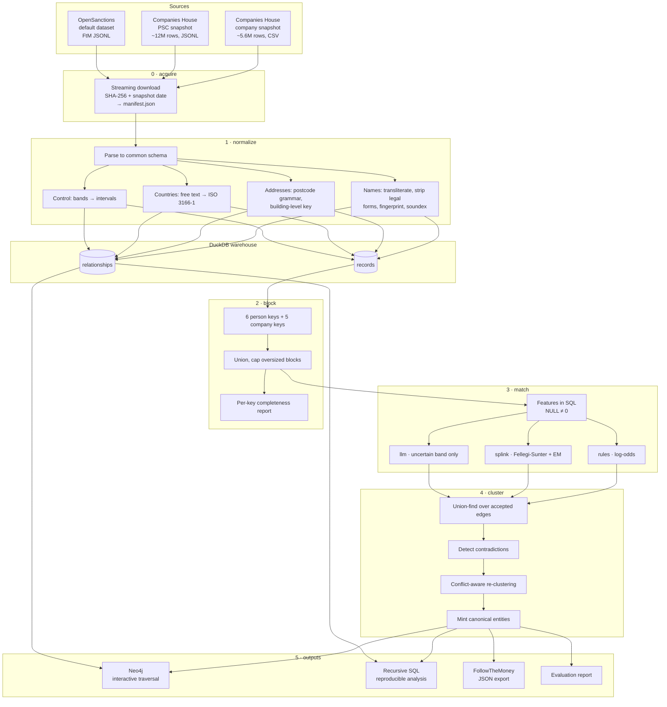

# Architecture

## Pipeline

## Stage contracts

Each stage reads and writes the warehouse and is independently re-runnable.
That is what makes the pipeline debuggable: a matcher change re-runs matching
and clustering in seconds without re-parsing 12M JSON lines.

| Stage | Reads | Writes | Idempotent |
|---|---|---|---|
| `acquire` | HTTP | `data/raw/` + manifest | Yes — skips existing files unless `--force` |
| `normalize` | raw files | `records`, `relationships` | Yes — truncates first |
| `block` | `records` | `blocking_keys`, `candidate_pairs` | Yes |
| `match` | `candidate_pairs`, `records` | `pair_scores` | Yes — per matcher |
| `cluster` | `pair_scores`, `records` | `clusters`, `canonical_entities` | Yes, and deterministic |
| `load-graph` | `canonical_entities`, `relationships` | Neo4j | Yes — `MERGE` throughout |
| `analyse` | `clusters`, `relationships` | `outputs/analysis/` | Yes |
| `evaluate` | everything + truth | `outputs/eval/` | Yes |

## Data model

### `records` — one assertion about one entity, from one source

A record is **not** an entity. Eleven PSC filings for the same person are eleven
records; resolution decides they are one entity. Keeping that distinction in the
type names avoids the most common bug in linkage code — treating a source row as
though it were already a resolved thing.

Key columns: `record_id`, `source`, `entity_type`, raw and normalised names,
`name_fp` (order-insensitive fingerprint), `name_phonetic`, split name parts,
`birth_year`/`birth_month`, ISO-coded `nationality`/`country`/`jurisdiction`,
`reg_number`, address fields plus `address_blk`, `topics` (OpenSanctions risk
vocabulary), and `context_company_number`.

### `relationships` — a directed control edge asserted by one filing

`source_record_id` (controller) → `target_record_id` (controlled), carrying
`min_percent`/`max_percent`, `control_kinds`, `capacities`,
`has_hard_control`, `via_fiduciary`, and validity dates.

### `clusters` and `canonical_entities`

`clusters` maps every record to a `canonical_id`. `canonical_entities` collapses
each cluster into one row, choosing attributes by frequency but **retaining the
full name list** — the alias set *is* the intelligence product for a screening
use case, and reducing an entity to its most common spelling discards exactly
the variants an analyst needs to search on.

Canonical ids are derived from the smallest member record id, so they are
deterministic across runs and traceable to a real filing. A random UUID would be
stable only until the next run, making stored decisions unattributable.

## Identifier scheme

| Source | Pattern | Stability |
|---|---|---|
| Company | `ch:company:{number}` | Registry-assigned |
| PSC filing | `ch:psc:{company}:{hash}` | From `links.self`, stable across daily snapshots |
| OpenSanctions | `os:{id}` / `os:{id}#{n}` | Upstream id; `#n` per name variant |
| Canonical entity | `ent:{min member id}` | Deterministic given the same clustering |

One OpenSanctions entity becomes several records — one per name variant —
because a sanctioned individual routinely carries a dozen spellings across
transliteration schemes, and it is precisely those variants that let an alias
match a UK filing where the canonical spelling would not. Blocking sees every
spelling; clustering collapses them again.

## Scale characteristics

Fixture corpus (1,200 companies / 2,656 records), 2 cores, 1GB DuckDB limit:

| Stage | Wall time |
|---|---|
| normalize | 1.6s |
| block | 0.4s |
| match (rules) | 0.7s |
| cluster | 0.6s |
| analyse + evaluate | ~3s |

Full national scale is ~6,500× more records. The dominant cost is the
candidate-pair join, which grows with block sizes rather than linearly. Expect
30–90 minutes end to end on a laptop with 16GB RAM and `OER_RUNTIME_DUCKDB_MEMORY_LIMIT=8GB`.

Where it would stop scaling: past ~10⁹ candidate pairs the join needs
partitioning across machines. Blocking keys are materialised as a table
precisely so they are already the partition keys for that rewrite.

## Testing strategy

110 tests, no network and no database required.

| Layer | Approach |
|---|---|
| Normalisation | Real observed variants, not synthetic edge cases |
| Clustering | Constructed conflict cases — the failure aggregate metrics hide |
| Graph load | Injected fake driver: payload shape, ordering, batching |
| LLM | Injected fake client: verdict parsing, caching, cost, guardrails |
| Pipeline | Invariants (every record clustered, no birth-year conflicts, canonical pair ordering) |
| Quality | Floors below measured performance, so regressions fail but noise does not |

CI additionally regenerates the fixtures from seed and diffs them against the
committed copy — if they drift, every published metric silently refers to a
corpus nobody can regenerate.
